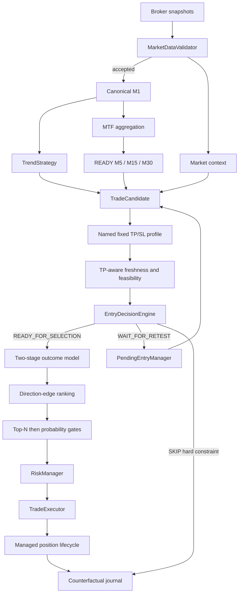

# Goblin!

> A deterministic intraday trading bot that lives in a cave, watches markets all day, and refuses to confuse activity with opportunity.

**Goblin!** is an experimental and auditable trading engine written in Python. It validates broker data, builds deterministic market structure, detects directional setups, estimates trading costs, scores the probability of reaching a fixed target, then applies explicit risk controls before an order can reach the broker.

> [!WARNING]
> Goblin is research software, not financial advice. Use `paper` or `etoro_demo` while the strategy is being calibrated. Real-money trading can lose capital.

## Core principles

- **Deterministic execution** — the same accepted data and versioned configuration must produce the same decision.
- **Demo first** — an edge is never assumed from a handful of trades.
- **Validated data only** — rejected or quarantined snapshots cannot create candles or entries.
- **Calibrated outcome evidence** — the live score is a direct scale of the
  estimated `TP_FIRST` probability.
- **Costs are part of the trade** — fees and spread are evaluated before selection and in net expectancy.
- **Explicit probabilistic gates** — probability and activity gates are named,
  versioned and journalled.
- **Hard constraints remain explicit** — invalid data, impossible economics, incompatible session horizon, invalid structure and risk limits may reject.
- **Every decision leaves evidence** — raw data, bars, candidates, contributions, routes, summaries and manifests are retained.
- **Doing nothing is valid** — zero trades can still be the correct outcome.

## Current capabilities

Goblin currently includes:

- one active, code-versioned `BalancedStrategyConfig`;
- local paper, eToro demo and eToro live broker adapters;
- crypto, US-equity and European-equity support;
- timezone-aware trading sessions and force-close windows;
- stateful market-data validation with jump quarantine;
- canonical fixed M1 candles and deterministic M5/M15/M30/H1 bars;
- explicit timeframe maturity: `UNAVAILABLE`, `PROVISIONAL`, `READY`;
- context-only benchmark instruments: `Crypto10`, `SPX500`, `FRA40`;
- benchmark, breadth, sector and compressed relative-strength scoring;
- deterministic BUY and SELL trend/breakout signals;
- three-factor TP feasibility with diagnostic entry freshness;
- frozen two-stage `TP_FIRST` / `SL_FIRST` / `NEITHER` probability model
  trained on US and European equities;
- structural retest pending entries with deterministic lineage;
- fixed named SL/TP profiles and structural pending stops;
- net breakeven and trailing-stop management;
- cooldown, account and session risk limits;
- SQLite position and cooldown persistence;
- JSONL journals, schema-v12 summaries and versioned run manifests;
- a broad pytest suite validated by GitHub Actions.

## Decision pipeline



## Canonical PR5-E score

```text
P_TP = P_TOUCH × P_DIRECTION
probability_score = round(200 × P_TP, 4)
```

The mapping is monotone by construction: a score of 20 means an estimated
`P(TP_FIRST)` of 10%, 40 means 20%, and 120 would mean 60%. The model does not
manufacture high scores when the evidence does not support them. Its maximum
leave-one-day-out score on the PR5-D cohort was 83, or 41.5%.

The former combined PR5-D score is removed from the runtime. Its raw
directional, context, timeframe and feasibility evidence remains journalled
and feeds the frozen probability features where applicable; it is no longer
reassembled into a legacy score or evaluated as a shadow policy.

### TP-aware entry freshness

Goblin measures how much directional session movement has already occurred relative to the target still requested:

```text
movement_consumed_to_tp_ratio
= directional session move / effective TP
```

The ratio becomes a continuous `entry_freshness_score` from 0 to 100. It no
longer adds points to the live score; it is one of the frozen `P_TOUCH`
features.

### Market context

The context model first calculates the market background from:

- benchmark session return;
- benchmark rolling momentum;
- same-market breadth;
- sector participation.

Directional relative strength then compensates that background. Its adjustment is multiplied by entry freshness:

```text
strong relative strength + fresh entry
→ meaningful compensation

strong relative strength + consumed move
→ limited compensation
```

A contrary benchmark is never a standalone veto. Relative strength, sector
participation and benchmark momentum are inputs to `P_DIRECTION`.

### Multi-timeframe contribution

PR5-E does not add fixed timeframe points to the live score. Maturity and
alignment are frozen model features for `P_TOUCH`; `P_DIRECTION` uses M5
maturity and the interaction between an aligned M5 and movement already
consumed.

### TP feasibility

`tp_feasibility_score_v4` combines:

| Component | Weight |
|---|---:|
| TP versus ATR | 35% |
| TP versus recent momentum | 30% |
| Estimated costs versus TP | 35% |
| TP-aware entry freshness | 0% — diagnostic only |

Its normalized score and former contribution transform remain explicit
features of `P_TOUCH`, but they are never added to the probability score. The
only feasibility hard reject is:

```text
estimated total costs >= gross TP distance
```

## Two-stage probability and ranking

`outcome_probability_v1` separates activity from direction:

```text
P_TOUCH     = P(TP_FIRST or SL_FIRST)
P_DIRECTION = P(TP_FIRST | one barrier is touched)

P_TP      = P_TOUCH × P_DIRECTION
P_SL      = P_TOUCH × (1 - P_DIRECTION)
P_NEITHER = 1 - P_TOUCH
```

For example, `P_TOUCH = 40%` and `P_DIRECTION = 35%` produce:

```text
P_TP = 14%, P_SL = 26%, P_NEITHER = 60%
```

`P_DIRECTION` is therefore not the overall chance of a TP. It answers:
“among decisive paths, which barrier is more likely to be first?”

The selector compares it with the conditional break-even probability:

```text
direction_break_even
= net loss at SL / (net gain at TP + net loss at SL)

direction_edge
= P_DIRECTION - direction_break_even
```

Candidates rank by `direction_edge`, then directional score, then deterministic
candidate ID. This reproduces the simulated challenger. It is separate from
the existing hard economics check that a reached TP must leave the configured
minimum net profit after costs.

The frozen model was fitted on 1,958 usable US/EU candidates from 22–24 July
2026. Leave-one-day-out validation produced TP/rest AUC 0.667, Brier 0.101 and
calibration error 1.8%. Direction discrimination remains weaker: TP/SL AUC
0.575. These are challenger results, not proof of profitability.

## Fixed V1 profiles

| Profile | Side | TP | SL | Stale horizon |
|---|---|---:|---:|---:|
| `us_intraday_fixed_v1` | BUY/SELL | 1.20% | 0.70% | 60 min |
| `eu_trend_buy_v1` | BUY | 2.00% | 1.20% | 180 min |
| `eu_intraday_fixed_v1` | SELL/base | 1.00% | 0.70% | 75 min |
| `crypto_intraday_fixed_v1` | BUY/SELL | 3.00% | 1.50% | 60 min |

The former US ATR-based TP/SL mode and missing-ATR fallback do not exist. A future attainable-target V2 is deliberately deferred until the fixed profiles and probability model are calibrated.

A confirmed pending setup may use a structural SL while retaining the named baseline target and probability calibration profile.

## Selection

| Asset class | `P_TP` gate | `P_TOUCH` gate | Top N |
|---|---:|---:|---:|
| Crypto | ≥ 12.5% | < 40% | 2 |
| US equity | ≥ 12.5% | < 40% | 1 |
| EU equity | ≥ 12.5% | < 40% | 1 |

The order is intentional:

1. apply route, readiness, structural and hard-economic checks;
2. rank by direction edge;
3. keep the asset-specific top N;
4. apply the `P_TP` and `P_TOUCH` gates without backfilling a rejected slot.

The strict policy is the initial live PR5-E policy. On the historical
leave-one-day-out replay it retained 28 candidates: 8 `TP_FIRST`, 2 `SL_FIRST`
and 18 `NEITHER`, for a mean counterfactual net result of +0.150%. Those
thresholds were selected after observing the three-day cohort, so the next
five complete sessions are an external frozen-policy validation rather than
proof of profitability.

Crypto was absent from that cohort. The runtime does not reject crypto as an
asset class, but marks predictions outside the training domain in probability
metadata. The next validation runs keep crypto out of `WATCHLIST`; the crypto
instrument and risk profiles remain available for a future dedicated cohort.

## Session horizon

Finite-session entries must have enough time remaining for:

```text
profile stale horizon + force-close buffer
```

This hard constraint applies to both new signals and pending confirmations. It prevents, for example, opening a 180-minute European profile shortly before the mandatory close.

## Managed stops

Breakeven protection is net of estimated costs:

```text
locked gross move = estimated total costs + configured net buffer
```

Trailing protection remains cost-aware and activates only when its candidate stop locks the configured minimum net gain. Every stop change emits `managed_stop_updated` and is persisted before the next snapshot.

## Market-data and timeframe invariants

- M1 is the only snapshot-built timeframe.
- Higher bars derive only from complete closed M1 bars.
- Missing prices are never fabricated.
- Candidate features obey no-lookahead boundaries.
- Live timestamp validation uses actual receipt/validation time.
- Historical replay keeps its supplied deterministic clock.

## Running

Python 3.12 or newer is required.

```bash
cp .env.example .env
bash scripts/start_goblin.sh
```

The launcher runs Docker Compose in the foreground so an intentional stop can finalize the summary and manifest.

Local execution:

```bash
python -m venv .venv
source .venv/bin/activate
pip install -r requirements.txt
python -m app.main
```

## Analysis contract

PR5-E uses summary schema **v12** and run-manifest schema **v10**. Standalone
`entry_decision` records include:

- deterministic candidate/pending lineage;
- named profile and effective SL/TP;
- probability score;
- directional, context, MTF and feasibility evidence;
- `movement_consumed_to_tp_ratio` and `entry_freshness_score`;
- `P_TOUCH`, `P_DIRECTION`, `P_TP`, `P_SL` and `P_NEITHER`;
- conditional direction break-even and direction edge;
- route and selection outcome.

The summary also exposes probability buckets, training-domain coverage,
profile horizon rejections, managed-stop updates and corrected risk-stage
counts.

## Pre-live status

Goblin remains **demo-only**. Before real capital, the project still requires:

- real broker exit fills;
- broker-side catastrophe protection for BUY positions;
- broker-to-local position reconciliation;
- daily-loss, drawdown and kill-switch controls;
- watchdogs and failure alerts;
- controlled price precision and rounding.

The current objective is repeatable calibration, not a claim of profitability.
