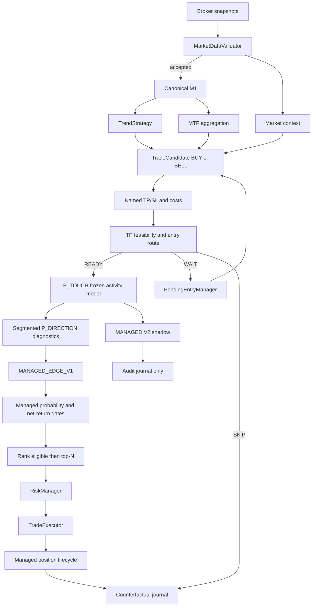

# Goblin!

> A deterministic intraday trading bot that lives in a cave, watches markets all day, and refuses to confuse activity with opportunity.

**Goblin!** is an experimental and auditable trading engine written in Python. It validates broker data, builds deterministic market structure, detects directional setups, estimates trading costs, models the race between take profit and stop loss, then applies explicit risk controls before an order can reach the broker.

> [!WARNING]
> Goblin is research software, not financial advice. Use `paper` or `etoro_demo` while the strategy is being calibrated. Real-money trading can lose capital.

## Core principles

- **Deterministic execution** — the same accepted data and versioned configuration must produce the same decision.
- **Demo first** — an edge is never assumed from a handful of trades.
- **Validated data only** — rejected or quarantined snapshots cannot create candles or entries.
- **Activity and direction remain separate** — `P_TOUCH` estimates whether a barrier will be reached; segmented `P_DIRECTION` estimates which barrier wins.
- **Costs are part of the trade** — the conditional break-even probability uses net TP gain and net SL loss.
- **One execution policy** — `MANAGED_EDGE_V1` alone can send equity or crypto candidates onward; the V2 challenger is computed and journalled in shadow only.
- **Every decision leaves evidence** — raw data, bars, candidates, model inputs, routes, summaries and manifests are retained.
- **Doing nothing is valid** — zero trades can still be the correct outcome.

## Current capabilities

Goblin currently includes:

- one active, code-versioned `BalancedStrategyConfig`;
- local paper, eToro demo and eToro live broker adapters;
- crypto, US-equity and European-equity support;
- canonical M1 candles and deterministic M5/M15/M30/H1 bars;
- benchmark, breadth, sector and relative-strength context;
- deterministic BUY and SELL trend/breakout candidates;
- named fixed TP/SL profiles, structural pending stops and TP feasibility;
- a frozen two-stage outcome model;
- four trained equity direction segments and two explicit provisional crypto segments;
- the frozen `MANAGED_EDGE_V1` selector applied before top-N;
- a frozen, four-segment MANAGED V2 challenger with separate Opportunity, Path Quality and Economics estimates, retained in shadow only;
- prior-only relative-spread context and adaptive anomalous-quote quarantine;
- side-aware executable position economics: BUY exits at bid, SELL exits at ask;
- one shared live/replay lifecycle for breakeven, trailing, TP, SL, stale and force close;
- broker close-fill reconciliation with explicit uncertain-close states;
- canonical typed close reasons and cooldown policies;
- versioned baseline and delayed-equity breakeven profiles;
- SQLite position/cooldown persistence and JSONL audit journals;
- a broad pytest suite validated by GitHub Actions.

## Decision pipeline



## Diagnostic outcome probabilities

For a candidate whose side, TP, SL and horizon already exist:

```text
P_TOUCH     = P(TP_FIRST or SL_FIRST)
P_DIRECTION = P(TP_FIRST | one barrier is touched)

P_TP      = P_TOUCH × P_DIRECTION
P_SL      = P_TOUCH × (1 - P_DIRECTION)
P_NEITHER = 1 - P_TOUCH

probability_score = round(200 × P_TP, 4)
```

`P_DIRECTION` is not the probability that the next candle rises. It is the conditional probability that the candidate's TP beats its SL among decisive paths.

### Frozen `P_TOUCH`

The activity component is unchanged from the previous probability model. It was fitted on 1,958 usable US/EU candidates from 22–24 July 2026 and is reproduced byte-for-byte by the V2 fitting script. This isolates the direction experiment from changes in activity calibration.

### Segmented `P_DIRECTION`

The direction component uses an exact segment selected from market and side:

| Segment | Status | Feature family |
|---|---|---|
| `EQUITY_EU_BUY` | trained | core movement/context |
| `EQUITY_EU_SELL` | trained | multi-timeframe |
| `EQUITY_US_BUY` | trained | plan geometry/feasibility |
| `EQUITY_US_SELL` | trained | multi-timeframe |
| `CRYPTO_BUY` | provisional transfer | US BUY geometry |
| `CRYPTO_SELL` | provisional transfer | US SELL multi-timeframe |

There is no generic runtime fallback. Crypto models are explicit artifact entries with `training_status=provisional_transfer`, zero crypto training rows and a named US source segment. They can be replaced later without changing the runtime contract.

Signed market variables are aligned to the candidate side: a negative return favorable to a SELL becomes a positive aligned feature.

### Conservative calibration

Each raw direction prediction is shrunk toward its segment's observed decisive TP rate:

```text
P_DIRECTION final
= 0.50 × raw model probability
+ 0.50 × segment prior
```

The journal retains the raw probability, prior, final probability, segment, feature family, training status and source segment.

## Managed edge and selection

The conditional direction break-even estimate remains journalled:

```text
direction_break_even
= net loss at SL / (net gain at TP + net loss at SL)

direction_edge
= P_DIRECTION - direction_break_even
```

It is no longer a universal gate. The active `MANAGED_EDGE_V1` policy estimates:

```text
P_PROTECTION
P_MANAGED_POSITIVE
EXPECTED_MANAGED_NET_RETURN
managed_edge = EXPECTED_MANAGED_NET_RETURN - 0.05%
```

Candidates must exceed their frozen segment floors for protection and positive
outcome, then have non-negative managed edge.

The segment-first MANAGED V2 challenger separately estimates whether the live
protection threshold is reachable, whether it is reached before the initial
stop, and the conditional net lifecycle return. It cannot replace, veto or
backfill the active V1 selection. Its four equity segments and all feature,
label, floor and artifact versions are recorded for a frozen shadow experiment.

Selection order:

1. apply entry route, readiness, feasibility and hard economics;
2. apply the managed protection, positive-outcome and managed-edge gates;
3. rank eligible candidates by managed edge, protection, positive probability,
   retained direction edge and deterministic candidate ID;
4. keep the asset-specific top-N: two crypto, one US equity, one EU equity;
5. apply RiskManager and execute.

The former minimum-`P_TP`, maximum-`P_TOUCH` and direction-edge vetoes do not
exist. The top-N policy and the absence of portfolio backfill remain deliberate.

## Evidence behind V2

The direction dataset contains all 3,527 labelled candidates from 22, 23, 24, 27 and 28 July 2026, including selected and rejected candidates. It contains 1,547 decisive paths: 475 `TP_FIRST` and 1,072 `SL_FIRST`.

Cross-day validation of the segmented direction architecture produced:

```text
P_DIRECTION AUC:   0.643
P_DIRECTION Brier: 0.202
```

A stricter train-22–24/test-27–28 check produced approximately AUC 0.588 and Brier 0.217. These figures justify a demo experiment, not a profitability claim. Strategic parameters and the MANAGED V2 shadow artifact remain frozen for the two complete demo weeks defined in the V2 protocol.

## Fixed profiles and managed exits

| Profile | Side | TP | SL | Stale horizon |
|---|---|---:|---:|---:|
| `us_intraday_fixed_v1` | BUY/SELL | 1.20% | 0.70% | 60 min |
| `eu_trend_buy_v1` | BUY | 2.00% | 1.20% | 180 min |
| `eu_intraday_fixed_v1` | SELL/base | 1.00% | 0.70% | 75 min |
| `crypto_intraday_fixed_v1` | BUY/SELL | 3.00% | 1.50% | 60 min |

Breakeven protection is net of estimated costs. Trailing protection activates only when the candidate stop locks the configured minimum net gain. Finite-session entries must have enough time for the stale horizon plus force-close buffer.

Position management uses executable prices throughout: bid for a BUY exit and
ask for a SELL exit. Broker fills are canonical when available. Post-trade P&L
deducts explicit costs only; spread remains a pre-trade feasibility input and is
not deducted a second time from executable fills.

Two explicit breakeven profiles exist:

| Profile | Crypto | EU equities | US equities | Status |
|---|---:|---:|---:|---|
| `corrected_baseline_v1` | 0.20% | 0.55% | 0.60% | live default |
| `delayed_equity_trigger_v1` | 0.20% | 0.65% | 0.70% | selectable experiment |

The buffer, trailing, TP/SL, stale horizon, sizing, risk and selector are identical
between profiles. Select an experiment only with `BREAKEVEN_PROFILE`; the chosen
name and thresholds are recorded in every manifest and startup event.

## Running

Python 3.12 or newer is required.

```bash
cp .env.example .env
bash scripts/start_goblin.sh
```

Local execution:

```bash
python -m venv .venv
source .venv/bin/activate
python -m pip install -e ".[dev]"
python -m app.main
```

Replay a logged cohort with the shared lifecycle:

```bash
python scripts/replay_breakeven_profiles.py PLAN.json report.json \
  --output-markdown report.md --validate-archives
```

Fit and replay the frozen MANAGED V2 research artifact:

```bash
python -m pip install -e ".[calibration]"
python scripts/fit_managed_v2.py PLAN.json \
  app/execution/scoring/models/managed_v2 fit-report.json \
  --dataset-json managed-v2-dataset.json
python scripts/replay_managed_v2.py PLAN.json replay-report.json \
  --output-markdown replay-report.md
```

## Analysis contract

Run-manifest schema V13 records:

- model and feature-contract versions;
- activity and direction dataset hashes;
- all six direction segments and their provenance;
- the managed selector and artifact provenance;
- the MANAGED V2 segment contracts, frozen component models, artifact hash,
  shadow status and quote-quality contract;
- the executable-price, position-economics, lifecycle, cost, close-taxonomy and
  cooldown contract versions;
- the selected breakeven profile and exact thresholds;
- the broker-fill-priority and explicit-cost-only convention;
- the packaged artifact SHA-256;
- code fingerprint, watchlist, profiles and runtime settings.

Standalone `entry_decision` records include the complete nested outcome estimate, so raw/final direction probabilities and segment metadata remain auditable without duplicate shadow decisions.

Daily summary schema V10 and analysis-ready schema V14 expose each closed
position’s signal price, executable estimate, broker fill provenance, bid/ask,
observed spread, gross P&L, explicit costs, net P&L and executable MFE/MAE.

See [Position lifecycle V2](docs/position-lifecycle-v2.md),
[Managed Edge V1](docs/managed-edge-v1.md),
[MANAGED V2 segment-first](docs/managed-v2-segment-first.md) and
[the breakeven replay decision](docs/breakeven-replay-v1.md).

## Pre-live status

Goblin remains **demo-only**. The close-detail endpoint is integrated, but real
run evidence must still confirm fill availability and timing. Before real capital,
the project also requires catastrophe protection, drawdown/kill-switch controls,
watchdogs and controlled price precision. The current objective is repeatable
calibration, not a claim of profitability.
